# Documentatie opdracht 4: Microsoft Deployment Toolkit

## Benodigdheden:

- Installatie van een Windows Server 2016 (Standalone server)
- Microsoft ADK (https://docs.microsoft.com/en-us/windows-hardware/get-started/adk-install#download-the-latest-windows-adk)
- Microsoft Deployment Toolkit 2013 Update 2 (https://www.microsoft.com/en-us/download/details.aspx?id=50407)

## 1. Installatie
Download alvorens het starten de benodigde packages die hierboven beschreven staan
### ADK
1. Start met de installatie van ADK
2. Doorloop volgende stappen in het installatieproces
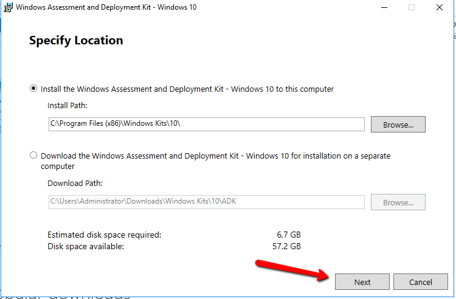
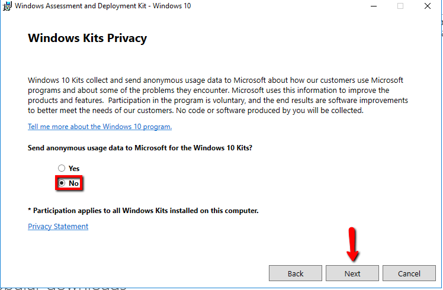
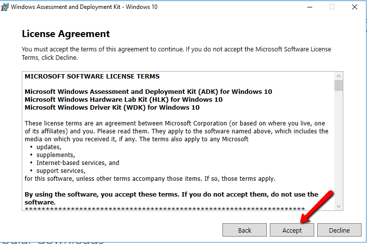
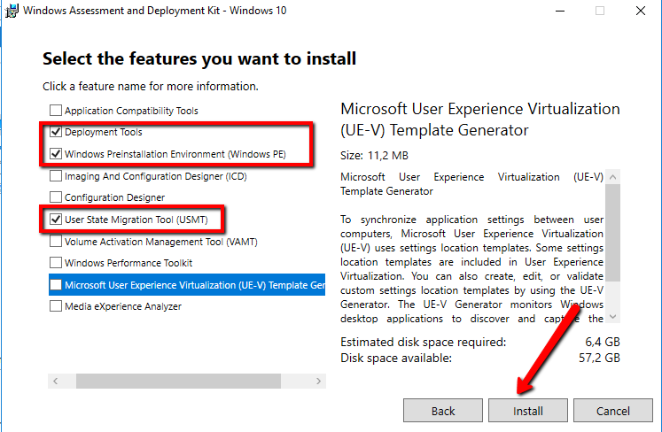
Even wachten ...
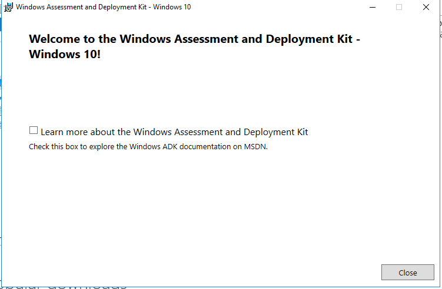
3. De installatie is afgerond!

### MDTK 
1. Start met de installatie van Microsoft Deployment Toolkit
2. Doorloop volgende stappen in het installatieproces
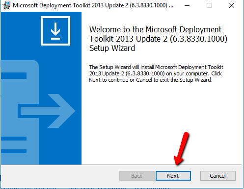
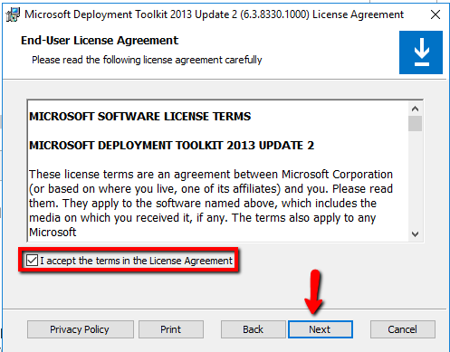
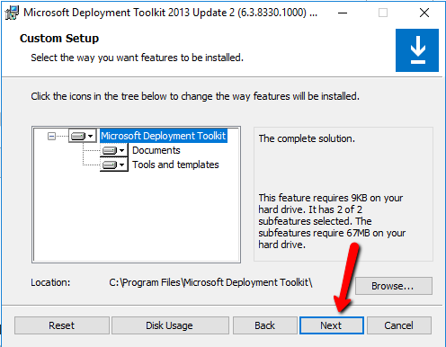
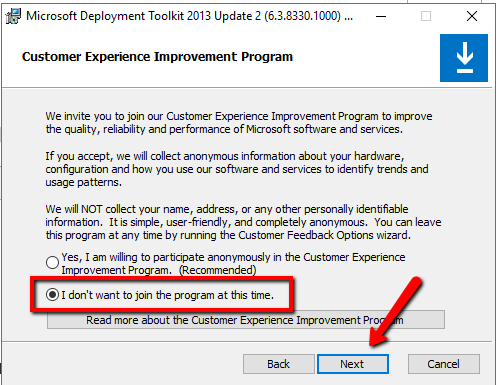
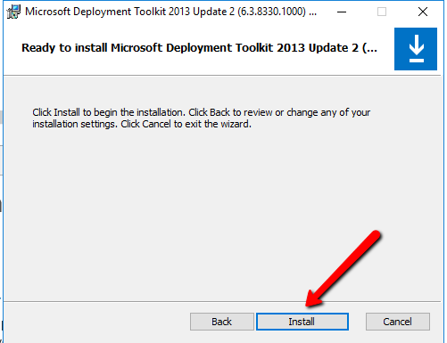
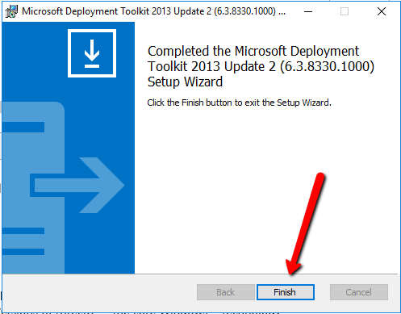
3. De installatie is afgerond!

### 2. Configuratie
1. Start Deployment workbench
2. Rechtslik deployment shares, en creËer een nieuwe deployment share.
3. Klik Next, en onthoud het pad, dit zal gebruikt worden om over het netwerk het pad te bekijken. (standaard is dit onzichtbaar gemaakt door de "$")
4. Klik 2x op next
5. Vink alle vinkjes uit, en duw op next.
6. Klik next
7. Mount het OS dat je wil deployen

### 3. Importen van het besturingssysteem
1. Ga terug naar de deployment workbench, en rechtsklik op operating systems, import operating system.
2. duw next
3. Selecteer het gemounte OS en duw next.
4. Duw 2x next
5. Bij operating systems zie je nu alle os'en staan die je kan deployen.

### 4. Toevoegen van applicaties
1. Download alle applicaties en zet elke applicatie in een aparte map.
2. Open de deploymentkit
3. Rechtsklik op "add application"
4. Vul een applicatienaam in., duw op next
5. Kies de gewenste plaats
6. Vul een executionscript in (bij exe: naam.exe /S, en bij msi msexec /qn /i naam.msi)
7. Duw op next en dan op finish

### 5. Verdere configuratie
1. Rechtsklik "properties"
2. Selecteer bij platforms supported x86 niet
3. Ga naar windows PE en selecteer x64
4. Apply configuratie
5. Rechtsklik op task sequences
6. New Task Sequence
7. Vul een ID en een task sequence name in.
8. Duw op next 2 keer
9. Selecteer het gewenste operating system
10. Maak de keuze om geen product key te gebruiken
11. Vul de full name en organization in.
12. Definieer een admin password
13. Duw op next en dan op finish
14. Dan klikt u op de eigenschappen en selecteert u de gewenste taken die uitgevoerd moeten worden (updates en software installations)

### 6. Creeëren van de ISO
1. Rechtsklik op MDT Deployment Share
2. Update Deployment Share
3. Selecteer Completely generate deployment share
4. Duw Next
5. Duw Finish
6. Kopiër de iso naar een plaats waar de vm deze kan zien

### 7. Installeren van de VM
1. Maak een nieuwe virtuele machine aan in virtualbox
2. Selecteer de gecreeërde iso als opstartfile
3. Start de virtuele machine op
4. Kies run
5. Er zullen credentials worden gevraagd, vul deze in. (Username/Password/Domain)

